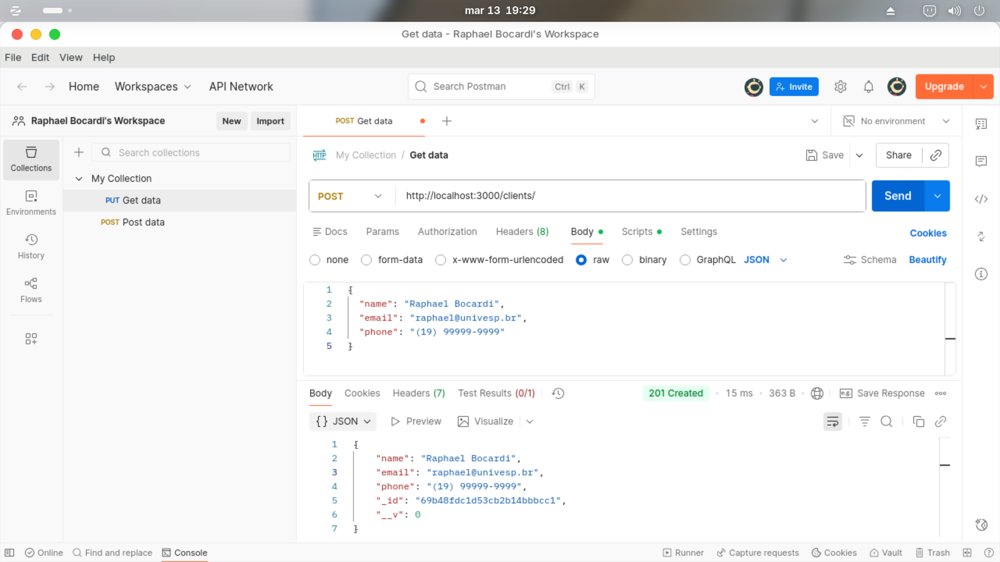
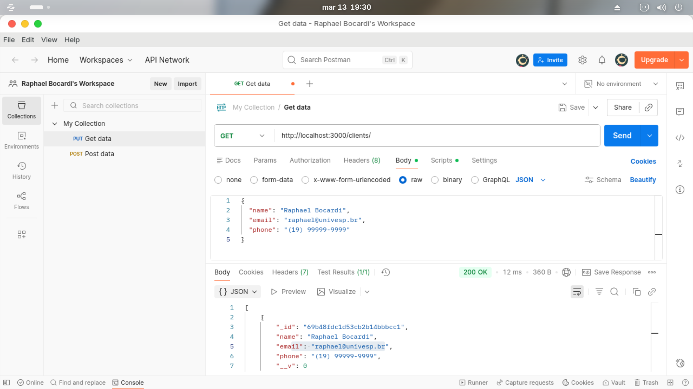
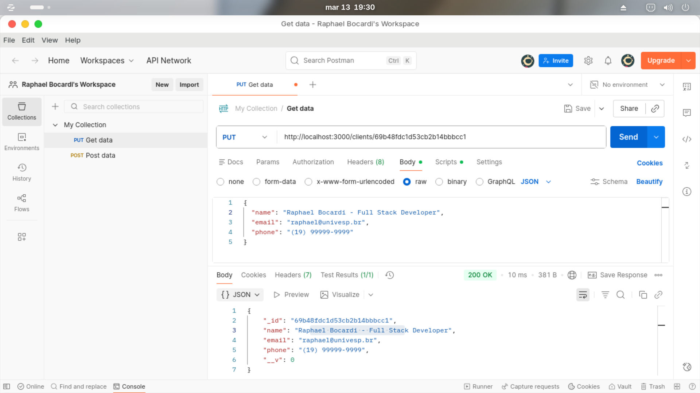
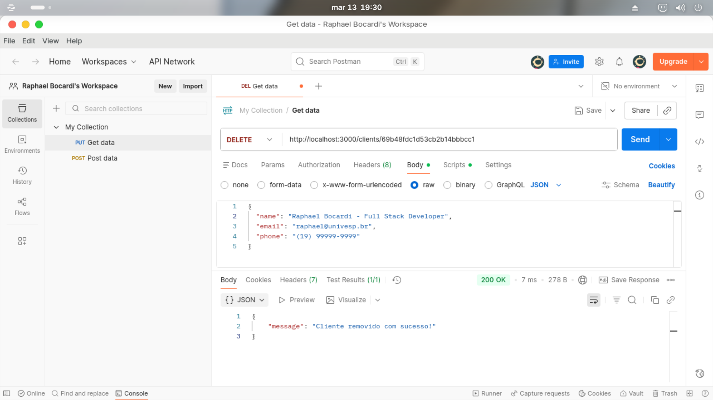
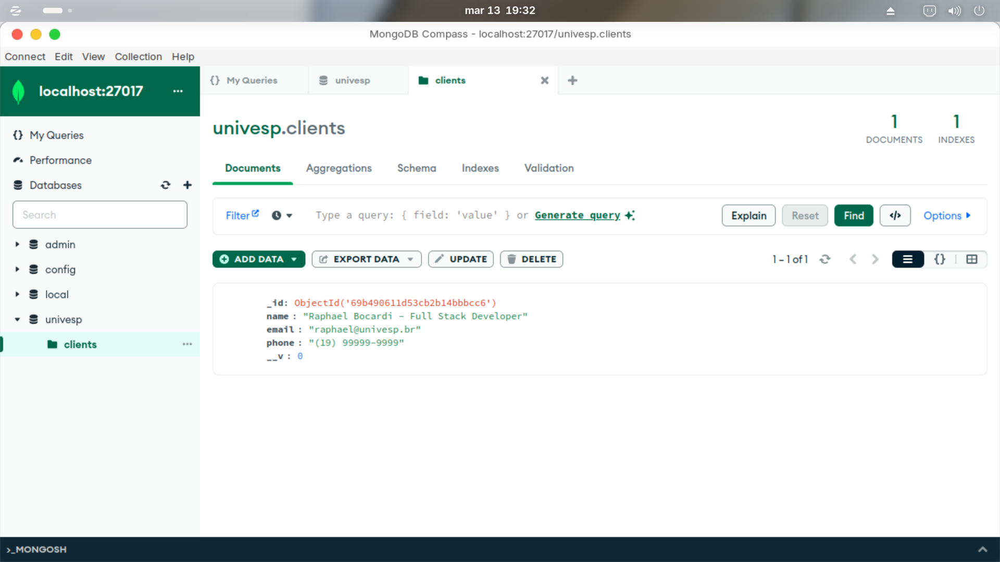

# 🚀 Node.js, Express & MongoDB CRUD API

[English](#english) | [Português](#português)

---

## English

This repository contains the development of a complete RESTful API for client management. The project was built to consolidate knowledge in backend systems and NoSQL data persistence.

### 🛠️ Technologies & Tools
- **Runtime:** Node.js
- **Framework:** Express.js
- **Database:** MongoDB (NoSQL)
- **Modeling:** Mongoose
- **Testing:** Postman & MongoDB Compass

### 🧠 Project Evolution
The project was expanded beyond the basic scope, including:
- **Analytical Perspective:** Modular folder structuring for environment isolation.
- **Technical Differentiator:** Added the `phone` (String) field to the database Schema, allowing the storage of formatted contacts.
- **Environment:** Developed entirely on **Zorin OS**.

### 📡 Endpoints (CRUD)
| Method | Route | Description |
| :--- | :--- | :--- |
| **POST** | `/clients` | Registers a new client. |
| **GET** | `/clients` | Lists all records. |
| **PUT** | `/clients/:id` | Updates data via ID. |
| **DELETE** | `/clients/:id` | Permanently removes a record. |

### 🎓 Credits
Project based on studies from the channel [Manual do Dev](https://youtu.be/ghTrp1x_1As).

---

## Português

Este repositório contém o desenvolvimento de uma API RESTful completa para gerenciamento de clientes. O projeto foi construído para consolidar conhecimentos em sistemas de backend e persistência de dados NoSQL.

### 🛠️ Tecnologias e Ferramentas
- **Runtime:** Node.js
- **Framework:** Express.js
- **Banco de Dados:** MongoDB (NoSQL)
- **Modelagem:** Mongoose
- **Testes:** Postman & MongoDB Compass

### 🧠 Evolução do Projeto
O projeto foi expandido para além do escopo básico, incluindo:
- **Perspectiva Analítica:** Estruturação modular de pastas para isolamento de ambientes.
- **Diferencial Técnico:** Adição do campo `phone` (String) ao Schema do banco de dados, permitindo o armazenamento de contatos formatados.
- **Ambiente:** Desenvolvido integralmente em **Zorin OS**.

### 📡 Endpoints (CRUD)
| Método | Rota | Descrição |
| :--- | :--- | :--- |
| **POST** | `/clients` | Cadastra um novo cliente. |
| **GET** | `/clients` | Lista todos os registros. |
| **PUT** | `/clients/:id` | Atualiza dados via ID. |
| **DELETE** | `/clients/:id` | Remove um registro permanentemente. |

### 🎓 Créditos
Projeto baseado nos estudos do canal [Manual do Dev](https://youtu.be/ghTrp1x_1As).

---

### 📸 Evidências dos Testes / Test Evidences (CRUD)

| POST (Create) | GET (Read) |
|---|---|
|  |  |

| PUT (Update) | DELETE (Delete) |
|---|---|
|  |  |

| Banco de Dados / Database (MongoDB) |
|---|
|  |